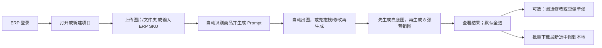

# AI 商品出图平台需求边界确认表（精简版）

日期：2026-07-30
状态：2026-07-30 全部确认；本文是唯一产品需求边界
原始答题记录：`SYSTEM-BOUNDARY-CONFIRMATION.md`
维护人：主 Agent

## 0. 文档使用方式

这份文档只保留真正影响员工使用方式的业务决定，不再询问数据库、轮询、备份实现、技术状态名等工程细节。

- A–N 已按业务负责人填写内容和后续确认整理。
- 本文是实现、验收和 Agent 任务拆分的唯一产品边界。
- 原始答题记录只保留追溯用途，不再驱动实现。

## 1. 最终产品主流程



业务页面只保留：

1. 工作台：项目列表和待处理数量。
2. 项目工作区：导入、拖拽、名称、目标市场、Prompt 和生成。
3. 生产与结果：进度、结果选择、修改、重做和本地导出。
4. 管理后台：模板、规则、模型状态和系统监控。

登录页单独存在，不算业务页面。

## 2. A–E 已确认需求

### A. 项目与两套入口

- 一个项目是可持续使用的商品出图工作区，不是一次只能使用的批次。
- 同一项目可反复上传图片/文件夹，也可反复输入 ERP SKU，两种入口可以混用。
- 每次导入都明确提供“导入并自动出图”和“导入后整理”两个按钮；前者完成识别与 Prompt 后直接进入 1+8 生产，后者先进入商品卡工作区。
- 两种模式共用完全相同的识别、Prompt、生成、结果、修改与导出链路；系统只记住该项目上次选择，不使用隐藏开关。
- 项目顶部设置默认平台、国家、比例和分辨率；每个商品都可以单独覆盖自己的平台和国家。
- 项目在已有商品生成后仍可继续导入新商品；每次点击生成时只冻结本次所选商品的输入快照，不锁死整个项目。
- ERP 单次最多输入 50 个 SKU，可多次追加。
- 同一项目内重复 SKU 或重复图片提示并跳过，不生成重复商品卡。
- ERP 只读取 SKU、商品名称和商品图片，自动填入商品卡；其他 ERP 字段不进入本平台。

### B. 文件夹与 TXT

- 子文件夹没有业务含义，整个文件夹只代表一次素材导入。
- 每张图片默认创建一个商品卡。
- TXT 只作为种子风格提示词，不是商品信息或完整生产 Prompt。
- 多个 TXT 进入项目风格区，由员工选择启用。
- TXT 默认应用于全部商品，也可以拖给某个商品作为单独风格要求。
- 没有 TXT 时，系统根据商品身份信息自动生成适合的营销生图 Prompt。
- 项目风格是默认值，每个商品可以单独修改。

### C. 商品卡、集群与拖拽

- 图片拖入目标商品卡后直接完成分配，不弹确认窗口；页面提供撤销。
- 被拖空且从未生成的商品卡自动消失。
- 拖入后保留目标商品卡原来的商品名称；来源商品卡的识别名称不覆盖目标名称。
- 合并完成后，系统使用目标卡中的全部图片重新分析身份信息和 Prompt。
- 多图关系只有两个简单选项：
  1. `同商品参考`：角度、细节或包装。
  2. `多色/多款组合`：一套图共同展示多个变体。
- 一个商品卡只生成一套图；如果每种款式要各出一套，就保持为多个商品卡。
- 多色/多款组合可保留多个 SKU，并指定主 SKU。
- 单商品最多 16 张参考图。
- 第一张上传图或 ERP 图默认是主图，员工可以切换主图。
- 系统可以识别疑似相同商品，但绝不自动合并。

### D. 商品名称与身份识别

- ERP 导入直接使用 ERP 商品名称；员工可修改本项目显示名称，不回写 ERP。
- 上传图片后立即自动识别商品名称和身份信息。
- 不使用文件名作为临时商品名称；识别期间只显示“识别中”。
- 低置信度名称显示“名称待确认”，员工确认或修改后才能生成。
- 不设置员工需要维护的“商品品类”字段。
- 不要求员工填写卖点、规格或材质表单。
- 卖点为空时，DeepSeek 根据商品身份信息自动策划。
- 规格未知时正常生图，但不得在画面文字中编造尺寸或参数。
- 材质只在商品名称明确包含或图片能够可靠识别时使用；无法确认时不生成精确材质声明。
- 删除“商品关系冲突”这一业务概念；只要有有效图片和已确认商品名称，就可以进入 Prompt 与生成。

### E. Prompt、身份锁与竞品

- 图片完成识别后，系统自动生成商品身份卡和整套营销 Prompt。
- 员工不需要经过独立商品资料页、AI Brief 确认页或 Prompt 审批页。
- 商品名称、商品补充资料、整套创意要求和每张图的创意 Prompt 允许员工修改；确认事实和商品身份锁的变更会进入新分析版本，不能在最终生成指令中静默移除已观察到的核心商品身份。
- 平台规则不单独展示给员工；第一次生成 Prompt 时由系统自动带入。
- 员工可以修改或删除平台建议性创意，但平台硬规则、商品核心身份、事实来源和以下技术边界不可绕过：
  - 每套必须包含标准白底产品图；Shopee VN 普通店的真实原图位于第 1 张、白底图位于第 2 张。
  - 比例和分辨率必须是 APIMart 支持的值。
  - APIMart 内容安全、账号权限和系统安全不能绕过。
- Prompt 首次自动生成；之后只有点击“重新生成 Prompt”才再次调用 AI。
- 手工修改自动保存，不产生“需要重新确认”之类的额外状态。
- 点击生成时，系统直接保存当时的图片、名称、市场、身份锁和 Prompt 快照。
- 竞品图作为单个商品的可选输入，最多 4 张；只提取风格、构图、光线和场景策略。
- 竞品风格摘要可以修改；竞品原图不作为我方商品生成参考。

## 3. F–N 已确认需求

### F. 套图、平台和市场

#### F01 每套图生成多少张

最终：默认共 9 张，即 1 张标准白底产品图和 8 张营销图；员工可以勾选本次需要生成的营销槽位，但白底图始终先生成。
你的答案：确认 `1 + 8`，共 9 张。

#### F02 默认 9 张图的职责

最终：

1. 标准白底产品图。
2. 第二角度/结构图。
3. 核心卖点图。
4. 材质或细节图。
5. 使用场景图。
6. 模特或比例展示图。
7. 尺寸、包装或包含物图。
8. 平台转化营销图。
9. 补充转化图。

员工可以直接修改每张图的 Prompt，因此不再增加复杂的“套图策划审批”。
你的答案：确认。

#### F03 比例和分辨率

推荐：项目默认 `1:1 / 1k`；每个商品可以从 APIMart 已支持选项中修改，不允许自由输入接口不支持的值。
你的答案：是的按照推荐来

#### F04 图片文字与语言

推荐：系统按商品目标国家自动选择语言，员工可以改语言或选择“不要图片文字”；第 1 张白底图始终不加营销文字。
你的答案：按目标国家自动选择语言，允许改语言或关闭图片文字；第 1 张白底图无营销文字，并作为后续 8 张营销图的商品一致性参考。

#### F05 模特和使用人群

推荐：系统自动根据商品推断婴儿、儿童、成人或宠物等使用对象，并直接写入 Prompt；员工需要时直接改 Prompt，不增加单独的模特确认步骤。
你的答案：嗯

#### F06 没有专属规则的国家

推荐：仍然允许生成，使用全球通用电商模板；不在员工界面反复显示“规则待确认”警告。
你的答案：嗯

### G. 生成与任务控制

#### G01 生成按钮

推荐：只提供“生成这个商品”“生成选中商品”“生成全部商品”。按钮显示商品数和图片数，点击后直接提交，不再增加第二个确认弹窗。
你的答案：嗯

#### G02 生成顺序

推荐：每个商品先生成第 1 张白底图；白底图成功后，其余所选图片并行进入队列。不同商品互不等待。
你的答案：嗯。现行例外：Shopee VN 普通店第 1 张保留真实上传/ERP 原图，第 2 张为白底图，第 3–9 张须等待白底图完成。

#### G03 暂停和取消

推荐：允许暂停或取消尚未提交给 APIMart 的任务；已提交任务继续完成并返回结果，不承诺供应商取消。
你的答案：嗯没必要提交了的只要那边生成了任务就算暂停也要给他返回已经生成的图片

#### G04 失败处理

推荐：支持“重做这一张”“重做当前商品失败项”“重做项目全部失败项”；已经成功的图片绝不重复生成。内容安全失败需要先修改 Prompt 再重做。
你的答案：失败项可以单张、单商品或全项目重试；网络/限流等临时错误由系统有限自动重试。成功图也可在结果页“再生成一个版本”。商品 Prompt 区提供“换一个 Prompt”，使用 DeepSeek 生成新版本；温度默认提高到 `1.2`，服务端限制在 APIMart 官方 `0–2` 范围。

### H. 结果选择与修改

#### H01 谁负责审核

最终：生成完成后必须人工审核；只有审核通过的具体版本可以选择和导出。要求修改、驳回或未审核版本永久保留但不可导出。
你的答案：确认，以后续明确提出的“生成完成后必须人工审核；只导出审核通过的图片”为准。

#### H02 是否允许批量通过

最终：结果页默认勾选全部最新审核通过图；员工可取消不想导出的图片，或对不满意的单张发起修改/重做。多个项目可以并行生产。
你的答案：确认。

#### H03 圈选修改工具

推荐：提供画笔、矩形/圆形圈选、橡皮、撤销、问题标签和文字说明；点击修改后只生成当前图片的新版本。
你的答案：嗯嗯

#### H04 AI 自动质检

最终：不增加 AI 自动质检节点；员工不满意时使用圈选和文字说明修改。
你的答案：确认。

### I. 批量导出到员工本地

#### I01 导出范围

推荐：支持当前商品、勾选商品和当前项目全部成功图；默认导出每个槽位最新成功版本，员工也可在历史中手动选择旧版本。
你的答案：嗯 按推荐来

#### I02 ZIP 文件结构

推荐：

```text
项目名称_日期.zip
├─ 商品名称__主SKU/
│  ├─ 01_白底标准图.png
│  ├─ 02_第二角度.png
│  └─ 09_补充转化图.png
└─ 导出清单.csv
```

没有 SKU 时只使用商品名称；重名时自动追加短编号。
你的答案：嗯

#### I03 导出格式

推荐：默认保持生成图片原格式；员工可选择统一转成高质量 JPG。
你的答案：本来导出就是按照最高规格来的 原图直出呀


#### I04 大批量导出

推荐：ZIP 过大时按商品自动拆包并逐个下载。系统保留导出记录，员工可再次导出，但不在 OSS 保存旧 ZIP。
你的答案：嗯

### J. 项目可见性与协作

#### J01 项目是否只对创建者可见

推荐：普通员工只看自己的项目，管理员看全部。
你的答案：嗯

#### J02 是否需要共享项目给同事

推荐：首版不做多人协同；如果确实需要交接，只增加“共享给指定 ERP 用户”，共享者拥有查看和编辑权限，不再设计复杂角色。
你的答案：不用

#### J03 管理员

推荐：初始只有刘学城；后续由服务器配置增加其他管理员。
你的答案：嗯

### K. 历史、归档和删除

#### K01 历史保留

推荐：原图、生成图、Prompt、批注和历史版本长期保留在 OSS/数据库，不自动到期。
你的答案：嗯

#### K02 员工能否删除项目

推荐：员工可以归档项目，但不能永久删除；误传敏感素材由管理员执行带审计的删除。
你的答案：可以归档；永久删除由管理员执行，不增加员工可见的审计流程。

### L. 通知和使用设备

#### L01 是否需要站外通知

推荐：首版只在平台内显示生成完成和失败，不接钉钉、飞书、邮件或短信。
你的答案：不需要

#### L02 支持哪些设备

推荐：完整功能只保证桌面 Chrome/Edge；手机只用于查看状态和结果。
你的答案：就只要web端就可以了

### M. 管理后台

#### M01 模板、规则和 Prompt 系统配置

推荐：普通员工只使用现有默认值和直接编辑商品 Prompt；管理员负责平台模板、规则来源、模型配置和系统 Prompt。
你的答案：嗯

#### M02 成本和系统状态

推荐：管理员可以查看 APIMart 用量、错误和队列状态；普通员工只看“排队、生成中、失败、完成”等业务状态。
你的答案：嗯

### N. 正式发布和容量

#### N01 正式访问入口

最终：只使用公网 IP + 端口，不配置域名；真实 ERP 密码登录前仍必须使用 HTTPS，证书采用 IT 下发并由员工设备信任的内部证书或可验证的 IP 证书。
你的答案：确认公网 IP + 端口入口。

#### N02 并发和每日 2,000 张

最终：不设置每日 2,000 张业务上限；供应商活跃任务上限为 500，但运行并发仍从 2 开始，按压测结果逐级提高。普通员工不显示额度。
你的答案：确认不设每日上限。

#### N03 APIMart 暂时不可用

推荐：员工仍可导入、分组和编辑 Prompt；生成按钮显示“出图服务暂不可用”，不自动切换其他模型。
你的答案：采用推荐值。

## 4. 已删除的复杂流程

以下内容不再进入产品设计：

- 项目追加批次和复制项目流程。
- 商品家族。
- 独立商品资料页和商品品类字段。
- AI Brief 审批页。
- Prompt 确认状态和“无阻断商品”概念。
- 单独的生成预检页面。
- 普通员工可见的平台规则页面。
- 独立导出中心。
- 长期保存导出 ZIP。
- 员工需要理解的 PromptVersion、Batch、Cluster、Attempt 等技术对象。
- 为缺失卖点、规格、材质设置复杂阻断状态。

版本、快照、权限、防重复提交和失败恢复仍由后端自动完成，但不增加员工操作步骤。

## 5. 最终确认

- [x] A–E 已确认需求准确。
- [x] F–N 已全部填写，未单独填写项采用推荐值。
- [x] 同意本文成为唯一产品需求边界。
- [x] 同意主 Agent 据此重写产品规格、实施计划和验收测试。

业务负责人确认：通过对话确认
确认日期：2026-07-30
