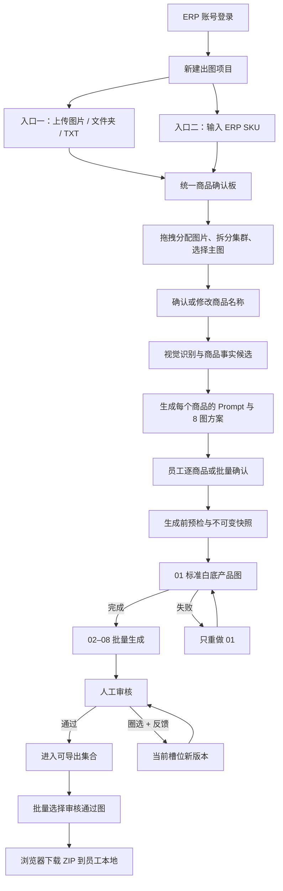

# AI 商品出图平台系统边界确认表

日期：2026-07-30
状态：原始答题记录，保留业务负责人填写内容；当前精简确认表见 `REQUIREMENTS-BOUNDARY-CONFIRMATION.md`
填写人：业务负责人
维护人：主 Agent

## 0. 使用方法

本文一次性收口产品、数据、AI、审核、导出、权限和部署边界，避免在页面开发过程中逐项反复确认。

- “已确认基线”无需重复回答。
- “待确认项”均有唯一编号、推荐默认值和“你的答案”。
- 可直接编辑本文，也可在聊天中按 `A01=...、A02=...` 回复。
- 如果全部接受推荐值，只需回复：`未填写项全部采用推荐值`。
- 在本文确认完成前，现有代码只作为技术验证，不视为最终产品行为。
- 本文确认后，主 Agent 将把结论同步到产品规格、实施计划、测试验收和 Agent 任务边界；旧文档冲突项同时更正。

## 1. 已确认基线

以下规则来自已确认业务决定，不再重复提问。

### 1.1 产品与用户

- 平台是公司内部批量 AI 商品图生产系统，不对外注册或收费。
- 首期最多约 100 名员工，目标组织每日最多 2,000 次图片生成提交。
- 普通员工不查看供应商成本、密钥、额度风险或原始技术日志。
- 不使用 Coze、飞书或旧工作流；任务、Prompt、审核和结果均由自建平台管理。

### 1.2 两套入口与统一主流程

- 新建项目提供两个并列入口：
  1. 上传图片、多个图片或整个文件夹。
  2. 输入 ERP SKU，获取商品名称和商品图片。
- 两套入口只在“素材怎么取得”上不同；取得素材后统一进入同一张商品确认板。
- 两套入口后续完全共用商品集群、名称确认、图片分析、Prompt、生成、审核、版本和导出逻辑。
- ERP 查询只消费 SKU、`productName` 和 `pic`；销售、库存、成本及其他字段不进入本平台业务数据或 Prompt。

### 1.3 商品集群

- 文件夹代表一次任意出图项目，不代表一个商品。
- 每张上传图片默认创建一个独立商品集群。
- 一个商品集群是“一套图”的最小生产单位：一个集群确认后默认生成一套 8 张图。
- 用户可把图片直接拖入目标商品集群完成分配，不要求每次弹出确认框。
- 一个集群可以包含一张或多张来源图；来源图可以是同一商品的角度、细节，也可以是业务主动合并的不同颜色或款式。
- ERP 商品也可继续拖入人工补充图。
- 拖拽、拆分、调整主图只改变尚未确认的工作版本，不改写已经提交的历史快照。

### 1.4 商品名称与识别

- 每个商品集群都允许员工填写或修改商品名称。
- ERP 导入时优先显示 ERP 商品名称。
- 文件夹导入未填写商品名称时，由视觉识别节点判断商品是什么，并给出待人工确认的名称。
- AI 识别结果不是不可修改事实；生成前员工必须能确认或修正。

### 1.5 TXT 与风格种子

- 文件夹内 TXT 只作为“种子风格提示词”，不是完整生图 Prompt，也不是商品资料主键。
- TXT 可以为空；为空时由营销 Prompt 节点根据商品、市场和套图模板自动提出风格。
- 项目统一种子风格会参与每个商品集群的 Prompt 生成。

### 1.6 Prompt 与模型

- 每个商品集群都会生成自己的商品理解、身份锁、套图方案和对应 Prompt。
- 员工可以在生成前查看、编辑并确认本商品的出图要求。
- 图像观察使用 APIMart 的 `gpt-5-nano-2025-08-07`。
- 文本分析、营销策划、Prompt 生成与优化使用 APIMart 的 `deepseek-v4-pro`。
- 图片生成和局部修改使用 APIMart 的 `gpt-image-2`。
- 不允许 AI 臆造未提供的材质、容量、认证、疗效、参数、优惠或包装内容。
- 竞品图只用于抽象 Style DNA 分析，不作为我方生成参考图。

### 1.7 套图、生成与审核

- 默认每套 8 张、`1:1`、`1k`；用户可从管理员发布且 APIMart 支持的选项中调整。
- 所有平台和市场的第 1 张固定为标准白底产品图。
- 第 1 张技术完成前，第 2–8 张不提交给供应商。
- 技术失败只重做失败项，不影响同批其他商品和图片。
- 生成完成必须人工审核；只有人工审核通过的最新版本可导出。
- 审核驳回可填写问题、圈选区域并创建新版本；原图、旧 Prompt、批注和历史结果永久保留。

### 1.8 存储与本地导出

- 原图、ERP 拉取图、标准参考副本、生成结果、Prompt、审核记录和历史版本保存在私有 OSS。
- 服务器只保留临时处理文件，不长期堆放图片。
- 批量导出只选择审核通过的最新版本。
- 导出时临时生成 ZIP，通过浏览器下载到员工自己选择的本地文件夹。
- 导出 ZIP 不在服务器或 OSS 长期保留；数据库只保留导出操作、选择范围、文件数和时间等审计记录。
- 浏览器不能静默写入任意本地目录；首版使用浏览器/操作系统“另存为”或默认下载目录。

### 1.9 登录、权限与部署

- 使用员工 ERP 账号密码登录；平台不保存 ERP 密码。
- ERP Token 只保存在服务端 session，浏览器只持有平台 Session Cookie。
- ERP 登录成功用户默认可进入平台。
- 刘学城是唯一初始管理员；其他用户默认为运营。
- 正式技术栈为 React + TypeScript + Vite 前端，Django 5.2 后端，PostgreSQL、Prompt Worker、Generation Worker、Caddy 和私有 OSS。
- APIMart 活跃异步任务硬上限为 500，但生产并发必须从 2 开始逐级压测，不把 500 直接配置为默认值。

## 2. 统一业务主流程



## 3. 核心对象边界

| 对象 | 业务含义 | 关键规则 |
| --- | --- | --- |
| 项目 | 一次店铺、活动或任意批量出图工作 | 包含平台、市场、模板、风格种子和多个商品集群 |
| 来源素材 | 上传图片、TXT、ERP 图片或竞品图 | 原始素材不可覆盖；竞品图与我方商品图严格隔离 |
| 商品集群 | 一套图的生产单位 | 默认一图一集群；拖拽后可多图；每集群独立名称、Prompt、审核和结果 |
| 商品关系 | 集群内多图如何共同使用 | 同商品参考、多色/多款组合等关系由员工确认 |
| 商品事实 | 已确认的名称、规格、卖点和已知信息 | 人工/ERP/视觉事实分来源；未知内容不可升级为事实 |
| 身份锁 | 生图时不可改变的商品特征 | Logo、颜色、结构、部件、包装和比例等 |
| Prompt 版本 | 一次生成所使用的完整指令快照 | 项目风格、商品事实、槽位任务和规则共同编译；确认后不可变 |
| 输出槽位 | 一套图中的第 1–8 张 | 每槽位独立状态、版本、审核与重做 |
| 生成版本 | 某槽位的一次生成或修改结果 | 新版本不覆盖旧版本 |
| 审核记录 | 人工通过或请求修改的决定 | 含问题标签、说明、圈选坐标和审核人 |
| 导出记录 | 一次本地下载行为 | 记录范围和数量，不长期保存 ZIP |

## 4. 待确认项

### A. 项目与两套入口

#### A01 同一项目能否混用两套入口

推荐：允许。可先输入 ERP SKU，再上传补充商品或图片；两种来源最终都进入同一确认板。
你的答案：允许

#### A02 创建项目时先选平台/市场，还是导入后再选

推荐：先创建项目并选择平台、市场、模板、比例和分辨率，再导入素材；确认板顶部可修改，生成确认后锁定。
你的答案：这个的话选好一个可以反复导入 或者说他们对于每个产品下面还可以修改对应的站点国家 就是让操作更加可编辑 不会让系统操作写的太死 同时也回答了你A03问题

#### A03 一个项目是否只对应一个平台和一个市场

推荐：是。同一批商品要同时发 Shopee SG 和 TikTok US 时创建两个项目，避免规则、语言和套图混用。
你的答案：

#### A04 ERP SKU 单次输入上限

当前实现：单次最多 50 个 SKU，可分多次追加到同一未生成项目。
推荐：保持 50。
你的答案：是的

#### A05 文件夹单次图片上限

当前设计：最多 100 张图片、20 个 TXT，单张图片最大 20 MB。
推荐：首版保持，稳定后根据真实运营批量再提高。
你的答案：

#### A06 重复导入处理

推荐：同一项目内重复 SKU 提示“已存在”并允许跳过；重复图片按文件哈希提示，不自动创建第二个商品集群。
你的答案：嗯 一般不会出现输入同一个sku的情况吧 不过做一个预防也没事

#### A07 项目生成开始后是否还能继续导入

推荐：不能修改已确认批次；需要追加商品时创建“项目追加批次”，在界面仍归属同一项目。首版可简化为复制项目后追加。
你的答案：好的

### B. 文件夹、TXT 与风格

#### B01 子文件夹是否有业务含义

推荐：首版不把子文件夹自动解释为商品或分类，只保留路径供展示；仍然每张图一个默认集群。
你的答案：嗯没有业务含义就是一个文件夹

#### B02 一个文件夹出现多个 TXT 时如何处理

推荐：全部列在“项目风格资料”中，由员工勾选启用；不按文件名自动拼接，AI 根据启用内容生成一份项目种子风格。
你的答案：嗯

#### B03 TXT 是否允许分配给单个商品

推荐：允许，但默认作为项目级风格；员工可将某个 TXT 拖到指定商品集群，变成该商品的补充风格要求。
你的答案：可以

#### B04 没有 TXT 时是否自动生成项目风格

推荐：是。系统给出可编辑建议；员工也可以保持空白，让每个商品按模板和市场自动策划。
你的答案：是的 我们不是本来就会先去识别物体就是识别身份卡那个 就可以根据身份卡让deepseek生成对应的营销生图提示词

#### B05 项目风格是否必须所有商品一致

推荐：项目种子风格是默认继承值；每个商品允许覆盖，但不得改变平台规则和商品身份。
你的答案：嗯

### C. 商品集群与拖拽

#### C01 拖拽后的即时行为

推荐：放下即分配并保存，顶部提供“撤销”；不弹确认框。服务端失败时自动恢复原位置并提示。
你的答案：嗯

#### C02 把集群最后一张图拖走时如何处理

推荐：空集群自动删除；历史中已有生成任务的集群禁止清空。
你的答案：嗯

#### C03 集群内多图关系

推荐：每个集群提供两个关系选项：

1. `同一商品参考`：角度、细节、包装等共同约束同一个商品。
2. `多色/多款组合`：允许一套图共同展示多个变体，Prompt 明确不得把多个变体融合成不存在的新商品。

默认选择 `同一商品参考`，员工可在集群卡片直接切换。
你的答案：嗯

#### C04 多色/多款组合是否也只生成一套 8 张图

推荐：是；这是把它们拖入同一集群的业务含义。若要每款各出一套，则保持为独立集群。
你的答案：嗯

#### C05 一个多色/多款组合能否同时保留多个 SKU

推荐：允许集群绑定多个 SKU，并指定一个主 SKU；导出目录使用主商品名称，清单列出全部 SKU。
你的答案：嗯

#### C06 单个集群最多参考图数量

当前 APIMart 与系统设计上限：16 张，其中 1 张主图、最多 15 张补充图。
推荐：保持 16。
你的答案：嗯

#### C07 主参考图如何确定

推荐：默认第一张为主图；ERP 图默认是 ERP 集群主图；员工可拖拽或点击“设为主图”更换。
你的答案：嗯

#### C08 系统是否自动合并疑似同商品

推荐：不自动合并，只显示“疑似同商品”建议；最终由员工拖拽决定。
你的答案：不要自动合并 虽然我们会先识别他的产品是什么

### D. 商品名称、事实与视觉识别

#### D01 商品名称优先级

推荐：人工确认名称 > ERP 商品名 > AI 识别名称 > 文件名临时占位。
你的答案：嗯 但不要有文件吗临时占位 并且如果是sku通过ERP导入的话那就可以自动的填充对吧

#### D02 AI 识别何时执行

推荐：素材归档后自动执行；确认板先显示“识别中”，不阻塞员工继续分组。
你的答案：就是上传后直接自动识别 期间他们分组的话会移动可能有的集群就会消失 但是按照他拖进去原本之前的那个商品的识别名称为准

#### D03 低置信度名称如何处理

推荐：显示“名称待确认”并禁止该商品进入生成；员工确认或修改后解除。
你的答案：好

#### D04 除商品名称外，哪些资料缺失会阻止生成

推荐：只有无法识别主体、没有有效参考图、商品关系冲突和平台硬规则冲突阻断；卖点、规格、材质等缺失只警告，并禁止 AI 在对应槽位编造。
你的答案：商品关系冲突是什么意思 卖点没有的话可以自动根据商品身份信息生成  规格没有的话不在生成图片里捏造 就正常生图就可以 然后材质没填的话我们识别不也是可以识别出来的吗 或者是根据产品名称知道

#### D05 ERP 商品名能否被员工修改

推荐：允许在本项目内修改显示名称，不回写 ERP；同时保留 ERP 原始名称用于审计。
你的答案：可以

#### D06 是否需要商品品类字段

推荐：需要。AI 识别后员工可修正；用于模特、场景、模板和合规规则，不要求员工从复杂类目树中选择。
你的答案：不用

### E. Prompt、AI Brief 与竞品

#### E01 普通员工编辑什么

推荐：员工直接编辑“商品出图要求/AI Brief”，包含商品名称、卖点、禁用项、风格和特别要求；系统在下方生成可展开的 8 个槽位 Prompt。商品身份锁和平台硬规则不能被普通编辑删除。
你的答案：商品身份锁也可以编辑 平台规则不用写出来吧 这个就是放到我们提示词生成的背后的东西

#### E02 是否允许普通员工编辑完整生产 Prompt

推荐：允许编辑每槽位的“创意段”，但系统锁定商品身份、事实来源、平台规则、输出参数和修订约束；避免一段自由文本绕过安全边界。
你的答案：全部可以修改 允许绕开你说的安全边界

#### E03 Prompt 的确认粒度

推荐：商品卡先展示整套方案摘要；展开后可编辑 8 个槽位。支持“确认当前商品”和“确认全部无阻断商品”。
你的答案：什么叫“确认全部无阻断商品”

#### E04 修改项目风格后如何更新商品 Prompt

推荐：未确认商品自动标记“需要重新生成 Prompt”；已确认或已生成商品不自动改变，必须创建新版本。
你的答案：你会不会把整个流程想的太复杂了呢

#### E05 AI Prompt 优化触发方式

推荐：首次自动生成；之后只有员工点击“重新优化”才调用模型，避免输入时反复计费。
你的答案：

#### E06 竞品图作用范围

推荐：竞品图可设为项目级或指定商品级；只输出抽象 Style DNA。员工可以删除某条 Style DNA 建议后再确认。
你的答案：

#### E07 一个商品可上传多少张竞品图

推荐：最多 4 张，避免成本和风格冲突；项目级竞品图最多 8 张。
你的答案：

### F. 平台、市场、模板和可见文字

#### F01 是否允许一个项目选择多个市场

推荐：不允许。一个项目一个市场；跨市场复制项目，并重新生成本地化 Prompt 和可见文字。
你的答案：

#### F02 未发布规则的国家能否生产

已确认全球国家都可选。推荐：使用“全球通用模板”，显示规则待确认警告，但不阻止生成。
你的答案：

#### F03 套图张数是否允许员工自由输入

推荐：不自由输入，只能选择管理员发布的模板；默认 8 张，未来模板可为其他数量。
你的答案：

#### F04 8 张默认槽位是否采用以下结构

1. 标准白底产品图。
2. 第二角度/结构图。
3. 核心卖点图。
4. 材质/工艺细节图。
5. 使用场景图。
6. 模特/比例展示图。
7. 尺寸/包装/包含物图。
8. 补充转化图。

推荐：作为全球通用基线；Shopee/TikTok 站点模板可替换第 2–8 张职责，但不能替换第 1 张。
你的答案：

#### F05 图片上可见文字的默认语言

当前建议：SG/PH/US 英语；MY 马来语；TH 泰语；VN 越南语；ID 印尼语；TW 繁体中文；BR 巴葡。
推荐：按市场自动选择，项目创建时允许员工覆盖为已发布语言。
你的答案：

#### F06 员工能否关闭图片文字

推荐：可以选择“无文字套图”；第 1 张始终无营销文字。
你的答案：

#### F07 自动模特是否需要员工确认

推荐：系统根据商品品类和目标消费者自动匹配；在套图方案中显示模特年龄段、场景和禁用项，员工确认或修正。
你的答案：

### G. 批量生成、队列与失败

#### G01 生成提交范围

推荐：支持当前商品、勾选商品、当前筛选结果和全部已确认商品；每次提交前显示商品数与预计图片数。
你的答案：

#### G02 是否需要员工再次确认付费

推荐：不显示金额，但在最终按钮显示“将生成 X 个商品、Y 张图片”，要求一次明确确认，防止误点重复计费。
你的答案：

#### G03 第 1 张完成后第 2–8 张如何运行

推荐：同商品第 2–8 张并行排队；不同商品互不等待，由公平队列分配资源。
你的答案：

#### G04 是否允许暂停

推荐：允许暂停尚未提交给 APIMart 的任务；已取得供应商任务 ID 的图片继续完成和归档。
你的答案：

#### G05 是否允许取消

推荐：只允许取消尚未提交的任务；已提交任务不承诺取消，完成后仍进入审核。
你的答案：

#### G06 失败重试入口

推荐：支持单张、当前商品全部失败项、当前项目全部失败项；成功项绝不重复提交。
你的答案：

#### G07 内容安全失败如何处理

推荐：不自动重试；显示可理解原因，员工修改 Prompt 或素材后创建新版本。
你的答案：

### H. 人工审核与修改

#### H01 谁可以审核

推荐：项目创建者可以审核自己的图；管理员可审核全部。首版不设置独立“审核员”角色。
你的答案：

#### H02 是否允许批量通过

推荐：允许勾选批量通过，但必须显示大缩略图和身份/规则质检提示；白底图不提供“一键全通过整个项目”。
你的答案：

#### H03 审核问题标签

推荐首版：商品变形、Logo/文字错误、颜色错误、缺少部件、多出部件、背景不符、构图不符、模特不符、文案错误、平台风险、其他。
你的答案：

#### H04 圈选工具

推荐首版：画笔、矩形/圆形区域、橡皮、撤销、重做、文字说明；批注以相对坐标保存，不写入原图。
你的答案：

#### H05 修改版本次数

推荐：产品上不设固定次数；受组织每日生成上限和供应商安全策略约束，管理员可暂停异常任务。
你的答案：

#### H06 AI 自动质检能否直接通过

推荐：不能。AI 只给风险建议，最终必须人工点击通过。
你的答案：

### I. 批量导出到员工本地

#### I01 导出选择范围

推荐：全部通过图、当前项目、当前筛选、勾选商品、单个商品和指定槽位。
你的答案：

#### I02 默认 ZIP 结构

推荐：

```text
项目名称_平台_市场_日期.zip
├─ 商品名称__主SKU/
│  ├─ 01_白底标准图.png
│  ├─ 02_第二角度.png
│  └─ 08_补充转化图.png
└─ 导出清单.csv
```

无 SKU 的上传商品使用清理后的商品名称；发生重名时追加短编号，不覆盖文件。
你的答案：

#### I03 是否需要导出清单 CSV

推荐：需要。包含商品名称、SKU、槽位、版本、审核人和导出时间，不包含 Prompt、密钥、供应商 URL或内部成本。
你的答案：

#### I04 导出图片格式

推荐：默认保留生成结果格式；员工可选统一转为 PNG 或高质量 JPG，首版先提供“保持原格式”和“统一 JPG”。
你的答案：

#### I05 ZIP 太大时如何处理

推荐：超过单包上限时按商品自动拆为多个 ZIP，逐个下载；不为了大包长期存 OSS。
你的答案：

#### I06 是否保留“再次导出”记录

推荐：保留导出选择清单，员工可再次发起同范围的新 ZIP；不保留旧 ZIP 文件。
你的答案：

### J. 项目可见性、协作与权限

#### J01 运营是否只能看到自己创建的项目

当前实现：运营只看自己的项目，管理员看全部。
推荐：首版保持。
你的答案：

#### J02 是否需要把项目共享给同事

推荐：首版不做多人实时协同；如业务必须交接，增加“共享给指定 ERP 用户”的项目级权限，不做团队/部门复杂权限。
你的答案：

#### J03 共享用户能否修改和审核

推荐：未来共享时分为“只读”和“可编辑”；创建者和管理员可撤销。首版若不做共享则不实现。
你的答案：

#### J04 管理员范围

当前决定：仅刘学城。
推荐：管理员名单由服务器环境配置，后续新增必须明确指定 ERP 登录名并记录审计。
你的答案：

#### J05 员工离职或 ERP 停用后的数据

推荐：不能登录；历史项目保留，管理员可查看并转交，不删除历史。
你的答案：

### K. 数据保留、归档与删除

#### K01 “永久保留”的业务定义

推荐：原图、生成图、Prompt、审核和版本不设自动到期；只有管理员归档隐藏。因 OSS 成本需要清理时，必须另行制定保留政策并经业务确认。
你的答案：

#### K02 员工是否可以删除项目

推荐：不能永久删除，只能归档；误传敏感素材由管理员走受审计的紧急删除流程。
你的答案：

#### K03 是否保存 ERP 原始响应

推荐：不保存。只保存 SKU、商品名称、已归档图片和受控导入状态。
你的答案：

#### K04 是否保存完整 Prompt

推荐：保存每次实际提交的完整 Prompt 快照和模型版本，但只对管理员或有权限的项目成员展示。
你的答案：

#### K05 数据库备份策略

当前建议：每日备份到 OSS，保留 30 个日备份和 12 个每月备份，每月做恢复演练。
你的答案：

### L. 通知、状态与使用终端

#### L01 是否需要站外通知

推荐：首版只在平台内显示完成、失败和待审核，不接飞书、钉钉、邮件或短信。
你的答案：

#### L02 实时状态精度

推荐：页面可见时约 3 秒刷新，后台约 15 秒；供应商没有百分比时只显示真实状态和等待时间，不伪造进度条。
你的答案：

#### L03 支持终端

推荐：首版支持桌面 Chrome/Edge；手机只支持查看状态，不保证上传、拖拽、创作和圈选体验。
你的答案：

#### L04 断网恢复

推荐：已完成上传不重复；刷新后从服务端恢复分组、Prompt、生成、审核和版本状态。未保存的文本编辑提醒用户恢复草稿。
你的答案：

### M. 管理后台与运营配置

#### M01 普通员工能否创建套图模板

推荐：不能。普通员工选择已发布模板；管理员创建、测试、发布和回滚。
你的答案：

#### M02 谁发布 Prompt 节点版本

推荐：仅管理员；新版本先在基准商品集评测，通过后发布，可一键回滚。
你的答案：

#### M03 谁维护 Shopee/TikTok 规则

当前决定：由系统整理官方来源，刘学城最终发布。
推荐：来源、核对日期、站点和版本缺一不可；未发布市场使用全球通用模板。
你的答案：

#### M04 管理员是否能看到供应商成本和系统额度

推荐：可以；普通员工看不到金额，只看业务状态。
你的答案：

#### M05 是否需要人工用户管理

推荐：ERP 登录成功自动创建影子用户；管理员只负责停用、强制退出、角色和项目转交，不手工创建普通账号。
你的答案：

### N. 正式发布、安全与容量

#### N01 正式入口

推荐：当前 IP:端口只作测试；100 人真实使用前配置域名 HTTPS。
你的答案：

#### N02 登录安全

推荐：连续 5 次失败锁定 15 分钟，会话 12 小时；退出或 ERP Token 失效后重新登录。
你的答案：

#### N03 初始真实并发

推荐：`2`；通过真实任务测试后按 `5 → 8 → 50 → 100 → 250 → 500` 提升，任何一级异常立即回退。
你的答案：

#### N04 组织每日 2,000 张的含义

推荐：按“提交给供应商的图片任务数”计数，重做也计数；Prompt 分析不占图片额度。
你的答案：

#### N05 普通员工是否有固定个人额度

推荐：不设固定个人日额度；每人基础并发 2，闲时可借用空闲并发，有其他用户排队时恢复公平轮转。
你的答案：

#### N06 APIMart 不可用时

推荐：允许继续导入、分组、编辑资料和 Prompt；真实生图按钮进入阻断状态，不静默换模型。
你的答案：

## 5. 明确不做的范围

以下默认不进入首版；如需加入，请在本文末尾明确追加。

- 公开注册、外部客户租户、付费订阅或计费页面。
- 飞书、Coze 或旧平台兼容层。
- 完整在线 Photoshop、自由图层、任意画布排版。
- 员工自由切换模型或直接填写供应商参数。
- 自动跳过人工审核。
- 永久公开图片 URL。
- 普通员工查看密钥、供应商原始错误、成本或系统 Secret。
- 手机端完整创作、文件夹拖拽和圈选。
- WebSocket、Redis、RabbitMQ、Kubernetes 或微服务。
- 浏览器静默写入员工指定本地目录。
- 自动复制竞品商品、Logo、包装、人物、文案或可识别独特版式。

## 6. 当前文档冲突，待本表确认后统一修正

现有项目文档存在以下旧口径，本表确认后一次性更正，不继续保留两套解释：

1. “SKU 是首选入口、文件夹只是补充”改为“两套并列入口，后续统一”。
2. “不同颜色/款式必须拆成独立 SKU”改为“默认独立；员工主动拖入同一集群时可按多色/多款组合生成一套”。
3. “TXT 需要复杂的自动作用域判断”简化为“默认项目种子风格，可人工分配给商品”。
4. “导出 ZIP 长期写入 OSS”改为“ZIP 临时生成并下载到员工本地，只保留导出审计记录”。
5. “整批下载可包含未审核的最新完成版本”统一改为“只允许审核通过的最新版本”。
6. “拖入时弹窗确认关系”改为“放下即分配，集群卡片单独设置图片关系并支持撤销”。

## 7. 最终签字

- [ ] 我已确认第 1 节已确认基线。
- [ ] 我已填写第 4 节全部待确认项，或同意未填写项采用推荐值。
- [ ] 我同意第 6 节旧文档冲突按本表统一修正。
- [ ] 我同意主 Agent 据此生成唯一产品规格、实施计划、Agent 任务和验收测试。

业务负责人确认：
确认日期：
