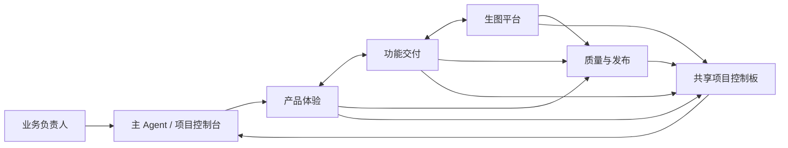

# Agent 主导的独立出图平台交付设计

日期：2026-07-29
状态：已获产品方向确认；本文是后续实现与协作的执行契约
范围：独立 AI 商品出图平台的团队协作、交付集群和第一阶段产品重设

## 目标

由一个主 Agent 作为项目负责人，带领专业 Agent 把现有“后端链路验证页面”升级为内部运营可用的批量商品图生产平台。主路线固定为“批量生产为主、单商品创作台为辅”。

目标用户是公司内部运营人员；首期目标为不超过 100 名员工、组织每日最多 2,000 次图片生成提交尝试。供应商 API 的活跃异步任务硬上限为 500，但当前预览默认并发为 2；完成跨进程原子认领、限流和分级压测前，不得把 500 当成当前可用吞吐量。

## 产品边界

用户完成的业务流固定为：

```text
工作台 → 新建出图项目 → 文件夹上传 → 商品/SKU 分组
→ 商品资料与 AI Brief → 商品创作台 → 批量生产队列
→ 审核中心 → 按平台导出
```

- 每张上传图片默认是一个商品/SKU 分组；用户拖拽合并后，表示同一商品的不同角度，只产出一套图。
- 首版不做自由画布、在线 PS、图层系统、多模型自由切换或对外多租户。
- Prompt 是结构化 Brief 的实现细节；运营优先编辑商品事实、身份锁、禁用项、场景和输出意图。
- Shopee/TikTok 规则只能作为已发布的模板与审核 checklist 使用；未核对完成的规则不允许作为自动合规承诺。

## 主 Agent 运行方式

主 Agent 是唯一的项目入口和集成责任人，负责：

1. 维护范围、优先级、产品术语和验收标准。
2. 先检查已有实现，再拆成互不重叠、可验证的专业任务。
3. 审查专业 Agent 的结论和代码，处理跨模块冲突，并运行集成验证。
4. 把任务结果同步到规格、计划、运行手册和工作日志。
5. 仅在发布门禁通过后安排真实供应商调用、OSS 接入或生产部署。

专业 Agent 不直接扩大范围、不在未授权情况下改动远端、不复制密钥。每项交付必须报告文件范围、验证结果、风险和下一项依赖。

### 会话拓扑

长期角色采用“一 Agent 一会话”，而不是把所有讨论、实现与验收混进同一个上下文：

```text
主 Agent（项目控制台）
├─ 产品体验 Agent 会话
├─ 功能交付 Agent 会话（按项目集群）
├─ 生图平台 Agent 会话
└─ 质量与发布 Agent 会话
```

这是按结果划分的交付流，而不是“产品经理交给前端、前端再等后端”的流水线。主会话保留产品优先级、跨角色决策、合并审查与发布权。专业会话保留各自的历史、任务清单和验收证据；它们可就接口和阻塞项直接沟通，但所有决定必须回写共享项目控制板，避免把聊天当成事实来源。只读盘点、单次查询或小型验证不创建长期会话，主 Agent 可临时分派后回收，防止会话数量超过真实工作量。

## 专业 Agent 职责

| Agent | 唯一责任 | 可修改范围 | 交付验收 |
| --- | --- | --- | --- |
| 产品体验 Agent | 产品经理与 UX 的合并职责：业务目标、用户流、页面、文案、优先级和验收 | 产品规格、页面验收、项目控制板 | 每项任务有用户价值、非目标、可读状态与验收标准 |
| 功能交付 Agent | 按项目集群完成一条端到端运营结果：页面、所需 Django API 适配和测试 | 当前集群涉及的模板、静态资源、视图、表单、窄范围服务和测试 | 用户不需要理解技术对象即可完成该条业务流 |
| 生图平台 Agent | 跨页面的高风险能力：任务状态机、队列、额度、供应商、存储、对象权限与可观测性 | `models.py`、迁移、`services.py`、worker、集成测试 | 事务、幂等、额度、重试、快照与权限有测试证据 |
| 质量与发布 Agent | 从需求进入就定义测试，独立验证安全、回归、预览和发布 | `tests/`、验收清单、runbook、发布记录 | 不通过时可阻止“可用”结论和部署 |
| 规则与研究 Agent（临时） | 官方规则、供应商契约、图像质量与模板资料的时限调研 | 研究资料、规则版本、种子数据 | 每条结论有来源、日期、适用站点与待确认项 |

前端和后端是能力，不是永久角色：当某个集群足够大，功能交付 Agent 可由主 Agent 临时拆为“页面实现”和“接口实现”两个短任务；两者必须先完成接口就绪门禁，完成后回归同一条功能交付验收。主 Agent 可以并行分派只读调研或文件互斥的任务；涉及同一个页面、模型、迁移、认证或部署时必须串行。

## 信息流与协作协议

不建立第二套 Jira/飞书式管理系统。仓库中的 `docs/project/STATUS.md` 是唯一项目控制板：主 Agent 维护当前目标、任务 owner、依赖、阻塞、决定和验收证据；每个角色会话只维护自己的工作上下文。



允许的直接沟通只包含两类：

1. **能力协商**：功能交付与生图平台确定字段、状态、错误和权限；结果写成接口契约。
2. **需求澄清**：产品体验与功能交付确认用户动作、边界和验收；结果写成任务卡或决策记录。

其他信息通过主 Agent 汇总。每张任务卡必须有 `owner`、`input`、`output`、`file scope`、`depends on`、`acceptance` 和 `evidence` 七项；未写入控制板的口头决定不能驱动实现。

### 三个交接门禁

| 门禁 | 发起与接收 | 必须留下的内容 | 未通过时的动作 |
| --- | --- | --- | --- |
| 需求就绪 | 产品体验 → 功能交付、生图平台、质量与发布 | 用户故事、非目标、状态、验收、风险 | 退回产品体验，禁止开始代码 |
| 接口就绪 | 功能交付 ↔ 生图平台 | 请求/响应、权限、错误、数据快照、兼容策略 | 退回协商，不各自猜字段 |
| 发布就绪 | 功能交付、生图平台 → 质量与发布 → 主 Agent | 自动测试、手工验收、迁移、健康检查、回滚与风险 | 禁止部署或标记“可用” |

这样既让角色之间直接解决问题，也让主 Agent 始终能看到完整信息流和真实进度。

## 项目集群与顺序

| 集群 | 目标 | 依赖 | 首个可验收成果 |
| --- | --- | --- | --- |
| 0. 交付基线 | 固定术语、主 Agent 规则、现有能力盘点、风险清单 | 无 | 文档与任务边界明确，旧 MVP 不再被当成最终产品 |
| 1. 生产工作台外壳 | 登录后控制台、项目导航、项目卡片、状态与额度摘要 | 现有登录和批次数据 | 首页不再是技术列表，能进入已有项目 |
| 2. 上传与 SKU 分组 | 新建项目、文件夹上传、商品卡片网格、拖拽合并、商品资料 | 现有上传与 cluster API | 一图一商品、合并多角度、资料可保存 |
| 3. 商品创作台 | 参考图、身份锁、Brief、槽位计划、AI 草稿 | 分组、输出槽位、Prompt 工作流 | 运营能按单商品选择套图意图并确认生成前输入 |
| 4. 批量生产与审核 | 队列、可读状态、失败重做、版本、通过/驳回 | 生成任务与结果存储 | 假模式完成“生产—审核—单项重做”闭环 |
| 5. 模板、规则与导出 | 已发布平台模板、规则快照、审核清单、ZIP | 审核结果、模板模型 | 可按 Shopee/TikTok 的已发布模板交付 |
| 6. 生产加固 | 原子额度、并发与退避、OSS、HTTPS、监控和真实契约测试 | 前述流程稳定 | 按 2、5、8、50、100、250、500 分级验证后，才可在授权范围内逐步承担真实付费生图 |

当前只启动集群 0 的治理与盘点；集群 1 是下一份实现计划的第一项。这样能先交付可信的运营体验，不用把可运行的 Django 后端推倒重来。

## 质量与发布门禁

每个集群完成前，主 Agent 必须确认：

1. 规格中的每个用户动作都有对应页面/API/状态，且没有用技术 ID 或 raw JSON 代替解释。
2. 新行为先有失败测试，再有最小实现；共享行为运行相关回归测试。
3. 操作员无法越权访问其他人的项目、素材、Prompt 或结果。
4. 失败、取消、重做、历史版本与额度状态均可见、可解释、不可静默覆盖。
5. 真实密钥不在代码库；真实 API/OSS/部署需单独授权与安全检查。

生产发布额外需要 Docker 健康检查、数据库迁移回退方案、受控访问入口、备份验证和明确的发布记录。HTTP 预览只允许测试账号和非敏感素材，不能作为 100 名员工的正式生产入口。

## 当前事实与明确缺口

现有 Django 后端已经具备账号权限、上传校验、一图一分组、拖拽合并/拆分、全局与商品资料、预检、假模式生成、失败重做和历史尝试。因此首阶段应复用其接口，集中重做页面和运营语言。

尚未达到生产要求的能力包括：模板/规则快照接入、审核与受限下载、PromptVersion 落库与绑定、私有 OSS、队列原子认领与限流退避、并发额度锁定、HTTPS 与登录限速。这些在集群 4 至 6 中逐项补齐，不得由漂亮界面掩盖。

## 不变的协作输入与输出

- 输入：用户业务决定、已发布平台规则、商品素材、现有 Django API、APIMart/OSS 的已授权配置。
- 输出：可运行页面、测试、规格与运行手册、部署记录、可追溯的任务/结果快照。
- 文档优先级：本文件定义协作与交付顺序；已确认的产品体验以 `2026-07-29-product-workbench-experience-design.md` 为准，竞品调研保留在 `../../research/2026-07-29-top-image-platform-redesign-research.md`；后端安全和部署边界以 `../../specs/2026-07-28-independent-image-platform-design.md` 为准。

## 下一步

主 Agent 在本文确认后，编写“集群 1：生产工作台外壳”的逐步实施计划，随后按文件互斥拆给前端、后端和 QA Agent 执行，并在每个任务后审查和验证。
