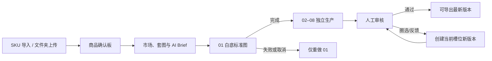

# 商品生产工作台体验规格

日期：2026-07-29
状态：已获业务确认，等待规格审阅后进入实施计划
范围：内部员工的 React 生产工作台、SKU/素材导入、商品创作、批量生产、审核与本地导出体验

## 1. 定位与设计依据

这是一个面向内部运营的“商品图生产系统”，不是通用后台、自由画布或在线 Photoshop。员工的心智始终是：**我正在为哪个商品、哪个市场，生产并审核哪一套商品图**。

采用已验证的交互模式，但不复制品牌视觉、图片或布局：

- [PhotoRoom 的商品图生产与批量处理](https://www.photoroom.com/ai-product-photography)：一张商品图可以进入干净商品图、场景图、虚拟模特和批量生产流程。
- [Adobe Firefly 的对象复合](https://helpx.adobe.com/uk/firefly/web/work-with-enterprise-features/create-object-composites/create-composite-scenes-with-uploaded-images.html) 与 [Markup 圈选修改](https://helpx.adobe.com/firefly/web/work-with-images/edit-images/use-ai-markup.html)：参考图、主体位置和区域修改需要被明确控制。
- [Canva Magic Studio 的低学习成本与角色权限](https://www.canva.com/en_in/newsroom/news/magic-studio/)：不让非设计人员在多个工具或复杂专业控件之间切换。

视觉语言固定为：深墨色左导航、留白充足的浅色内容区、紫色只代表主要行动、绿色/橙色/红色只代表状态。图片大于表格，业务名称大于技术 ID，短文案大于设置术语。

## 2. 不变业务规则

1. SKU 导入是首选入口；文件夹/图片上传是补充入口。SKU 查询仅取得 SKU、商品名和主图，不把销售、库存、成本或分类带入业务字段和 Prompt。
2. 默认“一张来源图 = 一个可售 SKU = 一套 8 张图”。同一可售 SKU 的角度/细节照片可显式合并为补充参考；不同颜色、花型、尺寸、包装或款式是独立子 SKU。商品家族只方便批量操作，不共享身份锁、审核或结果。
3. 第一槽永远是白底标准产品图。它完成前，槽位 2–8 不提交给供应商。白底图失败/取消只重做该槽；完成后，其他槽位可独立继续。
4. 套图默认 8 张、1:1、1k；管理员发布的市场模板与供应商可用参数可覆盖默认值。全球市场均可选，未配置规则时采用全球通用模板，不阻止生产。
5. Prompt OS 是系统实现。员工编辑结构化商品资料、身份锁、种子风格和图像意图；系统编译完整指令、预检事实风险、保留版本。不得把缺少的材质、尺寸、认证、疗效或优惠当作事实。
6. 竞品图只产生抽象 Style DNA，绝不作为我方生成任务的参考图，也不复制商标、包装、人物、原文案或像素级版式。
7. 图片技术完成不代表业务通过。必须人工审核；仅审核通过的最新版本允许导出。失败、驳回、Prompt、批注、圈选和历史版本永久保留。

## 3. 页面体系

| 页面 | 用户目的 | 核心动作 | 不展示的内容 |
| --- | --- | --- | --- |
| 生产工作台 | 知道该做什么 | 继续项目、新建项目、处理待审核与异常 | Batch/Cluster/原始任务日志 |
| 新建项目 | 建立生产上下文 | 粘贴 SKU、上传文件夹、选择市场/模板、填写种子风格 | 供应商参数与完整 Prompt |
| 商品确认板 | 确认“一商品是什么” | 合并补充参考、拆为子 SKU、补商品资料 | 自动把不同 SKU 合并 |
| 商品创作台 | 生产或修订一套图 | 切槽位、确认 Brief、生成、查看版本、请求修改 | 自由图层/在线 PS |
| 生产队列 | 管理规模化生产 | 筛选、暂停未提交项、只重做失败项 | 对员工显示成本或供应商风险 |
| 审核中心 | 人工决定交付版本 | 通过、驳回、圈选、问题标签、创建修订版本 | 直接覆盖旧图 |
| 导出中心 | 拿到可用本地文件 | 全选、精确选择、按平台打包、下载 ZIP | 未审核/旧版本混入交付包 |
| 模板与规则 | 管理员发布质量标准 | 发布/回滚模板、规则、Prompt 版本 | 普通员工修改生产规则 |

## 4. 关键操作流程



### 4.1 新建项目与商品确认

- 新建项目默认打开“导入 SKU”，支持粘贴多行 SKU；“上传照片/文件夹”是并列但次级入口。
- 对 SKU 导入，显示服务端返回的商品名和私有归档主图；每个有效 SKU 成为一张商品卡。部分失败不能阻断同批有效商品。
- TXT 和 SKU 导入文本框均为项目级“种子风格提示词”，不是完整生产 Prompt。为空时，营销图 Prompt 节点根据可见商品和市场提出风格。
- 商品卡提供“添加补充参考”和“创建独立子 SKU”。前者需要员工确认是同一可售 SKU；后者保留独立白底图、套图、审核与导出。

### 4.2 商品创作台

固定三栏：

- 左栏：SKU、主参考图、补充参考图、商品事实、身份锁和缺失信息。
- 中栏：当前输出槽位的大图、源图/版本对比、8 槽位时间线；`01 白底标准图`始终第一个。
- 右栏：人类可读的 AI Brief、市场规则、风险提示和当前操作；完整 Prompt 仅管理员可折叠查看。

每个槽位有独立状态：未提交、排队、生成中、待审核、已通过、驳回、失败、取消。白底门禁、失败重试和人工修订由服务端状态机决定，前端只清楚解释状态和下一步。

### 4.3 审核与精确修订

- 审核人员对照源图、身份锁、槽位目标与平台 checklist，通过或驳回当前版本。
- 画笔、区域、橡皮、撤销、问题标签和文字反馈只保存相对坐标与修订意图，不改写原图，也不出现在导出图。
- “请求修改”只为当前槽位创建新版本。系统指令必须说明“修改什么”与“必须保持什么”；先前版本、Prompt、批注、圈选和审核记录全部可回放。
- 技术失败的重试与审核驳回的修订是两条流程：前者重提同一任务，后者创建有差量说明的新版本。

## 5. 导出体验与本地文件组织

导出中心只列出审核通过的最新版本。员工可以选择：

- 全部通过图、当前项目、当前筛选结果、选中商品、单个商品；
- 某个平台模板（Shopee / TikTok / 全球通用）或某些输出槽位；
- 保存一个可复用的选择清单。

每次导出生成一个 ZIP 和 `导出清单.csv`。默认结构：

```text
项目名称_平台_日期.zip
├─ 商品名称__SKU/
│  ├─ 01_白底标准图.png
│  ├─ 02_核心卖点.png
│  └─ … 08_促销场景.png
└─ 导出清单.csv
```

商品名称保持可读，SKU 防止重名；服务端清理非法文件字符并以确定性后缀处理冲突，绝不覆盖同包文件。未审核、驳回、失败和旧版本不进入 ZIP。

网页不能绕过浏览器安全边界写入员工任意本地路径。首版点击“下载交付包”后由浏览器/操作系统的“另存为”窗口选择目标文件夹；员工也可选直接下载到浏览器默认下载文件夹。只有未来明确需要无人值守写入固定本地目录时，才引入公司安装的桌面助手。

## 6. AI 节点与模型职责

模型分工固定，普通员工界面不提供模型选择：

- 所有文本语义节点使用 `deepseek-v4-pro`：商品事实推理、身份锁编译、营销策划、消费者/模特策略、竞品 Style DNA 推理、本地化与规则、槽位 Prompt 编译、Prompt QA、审核修订指令和文本质检。
- 所有图片生成与局部修订使用 `gpt-image-2`：白底标准图、槽位 2–8、参考图约束下的重做、圈选修订版本。它不承担业务推理或平台规则判断。
- 模型 ID、网关地址、超时和输出上限只存在服务器受限配置；上线前用已轮换凭据契约测试模型可用性、结构化输出、超时、错误语义和费用边界。不得在浏览器、Prompt、日志或数据库错误文本中保存密钥。

| 节点 | 输入 | `deepseek-v4-pro` 输出 | 阻断/降级规则 |
| --- | --- | --- | --- |
| 媒体规范化 | 文件、尺寸、格式、哈希、OCR 原文 | 不调用模型 | 服务端解码/安全校验失败即拒绝该素材 |
| 商品事实与缺失项 | SKU、商品名、人工资料、媒体元数据/OCR | 已证实事实、未知项、待人工补充项 | 未知内容永远不能升级为商品事实 |
| 身份锁 | 已证实事实、人工不可变项、商品关系 | Logo/颜色/结构/配件/比例等硬约束 | 缺少信息显示风险，不自行补造 |
| 营销与消费者导演 | 商品事实、平台、市场、模板、种子风格 | 整套图的转化顺序、消费者/模特/场景策略 | 婴幼儿/成人等仅按商品类别和人工纠正产生 |
| 竞品 Style DNA | 人工确认的抽象视觉标签与规则 | 色彩、光线、画面层级、场景密度等抽象策略 | 不传竞品原图给生图模型，不输出可复制商标/包装/原文案 |
| 本地化与合规 | 已发布规则快照、市场、已证实事实 | 语言、禁用表达、可见文案建议、风险项 | 未发布规则使用全球通用模板并标记风险 |
| 槽位 Prompt 编译 | 身份锁、事实、策略、槽位、尺寸、修订差量 | 每个槽位自包含的生产 Prompt 与负约束 | 事实/规则/白底门禁不通过则不提交生图 |
| Prompt QA | 编译 Prompt、事实与规则快照 | 阻断项、警告项、可提交结论 | 阻断项必须人工修正后才能生成 |
| 审核修订导演 | 圈选相对坐标、问题标签、文字反馈、当前版本 | “只改什么、保持什么”的新版本差量指令 | 只创建当前槽位新版本，不覆盖历史 |
| 生成后质检 | 结构化技术指标、人工审核标签、规则清单 | 审核建议与风险摘要 | 不替代人工审核通过 |

`deepseek-v4-pro` 的官方模型 ID 已确认，但其官方集成资料标示为文本输入；因此它不能直接阅读源图、竞品图或生成图。首版不静默引入第三个模型：图片的技术元数据由非模型服务提取，商品视觉事实以 SKU 商品名、人工资料和身份锁为准，GPT Image 2 直接接收我方参考图生成图片。

若必须实现“自动解析竞品图视觉语言”或“自动比对生成图与源图的视觉事实”，需要业务明确授权一个**仅负责视觉观察的专用视觉模型**。该模型只能输出受限的视觉事实包；所有业务推理、合规判断和 Prompt 编译仍由 `deepseek-v4-pro` 完成。未获该授权前，竞品 Style DNA 只能由人工视觉标签驱动，系统不得声称自动读图。

## 7. 权限、状态与实时性

- 运营只能读取获授权项目、素材、结果和导出记录；管理员刘学城可管理模板、规则、Prompt 发布、用户与系统状态。
- 工作台和队列可见时 3 秒轮询，后台页 15 秒轮询，终态停止；使用 ETag/304。不为首版加入 WebSocket、Redis 或额外消息队列。
- 每人基础并发 2；没有其他用户排队时可临时借用空闲容量，出现排队后恢复公平调度。供应商 API 500 是硬上限，不是上线初始并发。

## 8. 技术边界与非目标

- React + TypeScript + Vite、React Router、TanStack Query、dnd-kit、Tailwind 和项目设计 token 承担运营体验；Django 5.2 继续承担 session 权限、API、任务、审计、Admin 和 Worker。
- 不重写已验证的任务状态机或登录体系；新页面只有在现有快照不满足时才增加窄范围 API。
- 首版不做自由图层、在线 PS、多模型自由切换、员工可见成本、移动端创作台、外部公开注册或桌面助手。

## 9. 验收标准

1. 员工可以从 SKU 或文件夹建立项目；SKU 部分失败时其他商品仍可继续。
2. 默认一图一 SKU；显式合并补充参考不会误合并颜色/款式/尺寸/包装不同的子 SKU。
3. 8 张套图中，白底标准图未完成时第 2–8 槽位无供应商提交记录。
4. 创作台没有 raw JSON，员工能在一屏理解当前商品、当前槽位、规则风险与下一步。
5. 审核圈选不会污染原图；请求修改只产生当前槽位的新版本；失败项可单独重做。
6. 导出“全选”只包含当前范围内审核通过的最新图；ZIP 按商品名称与 SKU 分目录，下载前可核对商品/图片数。
7. 用户刷新页面后，项目、版本、审核、导出和队列状态以服务端事实恢复。
8. 普通员工不能访问管理员模板/规则/Prompt 发布入口，也不能访问不属于自己的项目。

## 10. 实施切分

该规格拆为四个连续集群：

1. 生产工作台、品牌化登录与导航外壳；
2. SKU 导入、新建项目与商品确认板；
3. 商品创作台、8 槽位、Prompt/预检呈现与生产队列；
4. 审核圈选、版本修订与选择式 ZIP 导出。

每个集群复用既有 Django API 和任务状态；先完成界面/API/测试的整条可验收用户路径，再进入下一个集群。
