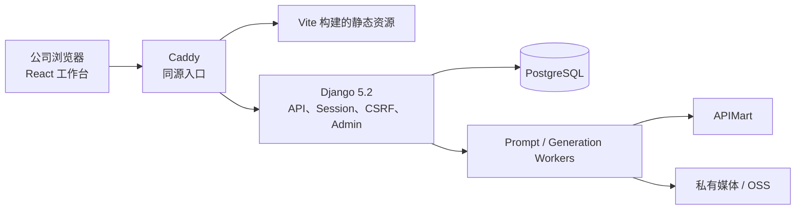

# React 前端架构设计

日期：2026-07-29
状态：已获确认；实现计划尚未开始
范围：独立 AI 商品出图平台的运营前端、与 Django 的边界、交互性能和部署方式

## 决策

保留 Django 5.2 作为后端与任务引擎；把面向运营的工作台从 Django 模板加原生 JavaScript 迁移为 React 单页应用。这个决策只替换用户界面层，不重写已有登录、权限、上传、分组、预检、生成和重试后端。

选择的前端组合：

| 范围 | 选择 | 用途 |
| --- | --- | --- |
| 组件与交互 | React + TypeScript | 工作台、商品卡、创作台、队列和审核的可组合 UI |
| 构建 | Vite，Node.js 22.12+ | 本地开发、热更新和生产静态资源构建 |
| 路由 | React Router | 工作台、项目、创作台、队列、审核等前端路由 |
| 服务端数据 | TanStack Query | 缓存、请求状态、轮询、失效和 mutation 回滚 |
| 拖拽 | dnd-kit | 商品/SKU 多角度图合并、拆分和排序 |
| 样式 | Tailwind CSS + 项目自己的设计 token | 统一间距、颜色、状态和响应式布局；不采用通用后台成品皮肤 |

不使用 Next.js、SSR、Redux、Zustand、WebSocket、微服务或新的任务队列。它们不能解决当前最核心的交互问题，反而增加维护和部署边界。

React 将页面组织为独立组件并显式管理 UI 状态；TanStack Query 用于缓存、同步和更新来自 Django 的服务端数据；dnd-kit 提供跨容器拖拽和排序所需的传感器与拖拽覆盖层，并建议使用 CSS `transform` 保持拖拽性能。[React 状态管理](https://react.dev/learn/managing-state) [Vite 构建与生产静态资源](https://vite.dev/guide/) [TanStack Query](https://tanstack.com/query/latest/docs/framework/react/overview?from=reactQueryV3) [dnd-kit](https://docs.dndkit.com/)

## 架构边界

- Caddy 在生产环境直接提供前端静态文件，并把 `/api/`、`/admin/`、`/auth/` 等请求反向代理给 Django。浏览器始终只访问一个域名/端口。
- Django 仍使用 session Cookie、CSRF 和对象级权限；React 不保存认证 token，也不直接访问数据库、供应商或 OSS 凭据。
- 现有 `/api/` 接口在迁移期继续可用。只有新页面确实需要不同的数据形状时，才新增小范围 `/api/v1/` 接口；不得为了“前后端分离”重写已验证的业务服务。
- 开发环境中 Vite 开发服务器将 API 请求代理到本地 Django；生产环境不保留 Node 前端服务器，Docker 构建后只保留静态文件。

## 状态与实时交互

| 状态类别 | 位置 | 规则 |
| --- | --- | --- |
| Django 数据：项目、商品、任务、审核结果、额度 | TanStack Query | 接口是事实来源；mutation 成功后更新或失效相关查询 |
| 短暂 UI：抽屉开关、选中槽位、筛选、未提交表单 | React component state / context | 不复制服务端对象，不用全局状态库 |
| 拖拽中的视觉位置 | dnd-kit | 结束拖拽后调用 Django；失败则恢复服务器状态并提示原因 |
| 队列进度 | TanStack Query 轮询 | 可见页面每 3 秒、后台每 15 秒；终态停止。保留 ETag/304，暂不使用 WebSocket |

该规则保证“正在拖动的卡片”响应迅速，但最终分组、主图、版本和额度仍以服务端事务为准。

## 性能原则

1. 路由级代码分割：工作台首屏不加载创作台、审核大图或导出模块。
2. 图片使用受权限保护的缩略图和懒加载；不在列表中加载原图或 base64。
3. 单个项目分组页首版最多展示 100 个商品卡，结果页按项目/商品分页；超出后先分页，不提前增加虚拟滚动库。
4. 拖拽只改 CSS `transform`，不在 `drag move` 中请求服务端或重新计算整页布局。
5. 上传走浏览器直传存储的预签名地址；现有本地存储只作为假模式与开发回退，正式 OSS 接入单独验收。
6. API 返回页面所需的摘要，不让前端每次拉取完整任务、Prompt 或历史版本。

## 迁移顺序

1. 创建 `frontend/` React 应用和共享视觉 token；Caddy/Django 维持原页面可用。
2. 迁移登录后的生产工作台与项目导航，使用现有项目列表和快照接口。
3. 迁移以 SKU 导入为首选的新建项目、文件夹补充上传与商品确认板；用 dnd-kit 调用现有合并/拆分接口。
4. 迁移商品创作台、AI Brief、生产队列与审核；仅在现有 snapshot 不足时补对应 Django API。
5. 在假模式完成端到端验收后，才接入模板规则、受控媒体预览、OSS、真实供应商契约测试与 HTTPS 发布门禁。

迁移期间旧 Django 模板页面是回退路径。某个 React 页面通过质量门禁后，才由 Caddy 路由到新的前端入口；不允许半迁移页面同时写同一业务状态。

## 验收与非目标

第一阶段验收：登录后能流畅进入工作台；项目卡、状态、额度和最近任务可读；刷新不丢失服务端状态；网络失败有明确提示；桌面 Chrome/Edge 可完成路径；接口请求仍受 Django 权限和 CSRF 保护。

非目标：首阶段不承诺移动端创作台、离线编辑、多人实时协同、自由图层、WebSocket 百分比进度、服务端渲染或任意规模无限滚动。
