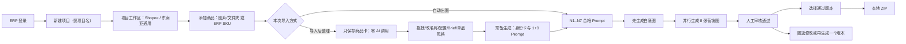

# 双速 AI 商品出图平台设计

日期：2026-07-31
状态：业务已确认；当前工作台与生成链路重构的实现设计基线
产品边界：`../../project/REQUIREMENTS-BOUNDARY-CONFIRMATION.md`

## 1. 目标

平台服务公司内部运营员工。员工可以上传图片/文件夹，也可以输入 ERP SKU；两种素材来源进入同一个商品工作区，最终为每个商品生成：

1. 1 张标准白底产品图。
2. 8 张电商营销图。

默认套图为上述 1+8。Shopee VN 普通店使用同为 9 张的官方例外：第 1 张保留真实上传/ERP 原图，第 2 张生成标准白底图，第 3–9 张为 7 张营销图。

自动模式完成图片识别、商品身份约束、营销策划、Prompt 和出图。整理模式先只保存素材，员工完成分组和资料后主动点击“预备生成”，系统才执行 N1–N7；预备阶段不生成图片。

## 2. 最短业务流程

每次导入显示两个明确按钮：

- `导入并自动出图`：常用快速模式。识别和 Prompt 成功后直接生产。
- `导入后整理`：只保存商品卡。员工整理后点击“预备生成”才执行 N1–N7，确认身份卡与 Prompt 后再正式生成。

系统记住该项目上次选择，但每次导入仍显示本次方式；不使用隐藏开关。低置信度商品名、无有效图片或模型不可用只暂停对应商品，不影响同项目其他商品。

## 3. 页面与导航

### 3.1 工作台

- 显示自己的项目、商品数、已完成数、失败数和正在生成数。
- 一个员工可同时打开多个项目；任务在服务端继续执行。
- 新建项目只填写项目名。进入工作台后默认显示“Shopee / 东南亚通用 / 1:1 / 1K”；平台、市场、比例、分辨率和项目风格均可在顶部直接修改。

### 3.2 项目工作区

- 顶部压缩为一行：项目名称、平台、市场、比例、分辨率、项目风格、添加商品、预备生成、正式生成和生产结果。平台使用“通用电商 / Shopee / TikTok Shop”直接按钮，常用市场使用中文按钮，更多国家进入可搜索面板。
- “添加商品”是页面常驻区域，含“图片/文件夹”“ERP SKU”页签；原生“选择图片”（单张/多张）和“选择文件夹”与拖入散图/文件夹共用现有导入链路。
- 待导入区显示无文件名缩略图；成功文件立即移出，失败文件保留重试，后续导入不得再次提交已经成功的文件。
- 每张图片默认创建一个商品；ERP 自动填入 SKU、商品名和图片。商品名称允许为空，界面只显示“可不填，AI 将根据图片识别”占位提示。
- 图片拖入商品卡即合并并可撤销；不再要求或显示多图关系。拖整卡合并商品，拖单张缩略图可排序或跨卡移动，拖到空白区拆成新商品。排序后的第一张为主参考，其余为参考图，并使旧准备结果失效。
- 商品使用响应式大卡片网格。上半部以 `object-contain` 完整显示第一张主参考图，下方横向显示全部真实缩略图，仅在溢出时滚动；不使用叠图占位，不显示源文件名。
- 卡片下半部直接编辑商品名称、平台、国家/站点与补充信息，并提供默认折叠的“单品风格（选填）”；非空单品风格完全替换项目风格，空值才使用项目风格。卡片同时显示生成勾选和当前节点进度；全选、取消全选、反选以商品 ID 保存，轮询不得重置，0 个商品选中时禁止预备和生成。
- 覆盖配置优先于项目默认，员工界面只显示当前实际值，不显示“跟随项目”。项目默认变化只重新准备实际配置发生变化的商品，不改写历史 Prompt、Generation 或审核记录。
- 点击商品卡后使用固定在视口侧边的浮层展示身份卡、事实台账和 1+8 Prompt；浮层不参与网格布局、不引起页面重排。同一时间只打开一个，内部编辑与拖拽不关闭。
- 可删除单张参考图或整个商品。没有生成历史时物理删除业务记录和私有素材；存在历史时只归档隐藏；活跃生成或提交状态未知时拒绝删除。
- 商品卡提供“预备生成”和“换一个 Prompt”；不增加 Brief 页、Prompt 审批页或预检页。
- 状态按 `待整理 → N1 → N2 → N3 → N4 → N5 → N6 x/8 → N7 → 预备完成 → 白底生成 → 营销图 x/8 → 待审核 → 已完成` 展示。只有网络、认证失效或服务端 5xx 显示全局错误；单商品等待或失败不影响其他商品。

### 3.3 生产与结果

- 按项目和商品展示 `识别中 / Prompt 生成中 / 排队 / 生成中 / 已完成 / 需处理`。
- 结果先进入待审核；只有人工审核通过的版本可以被选中导出。
- 单张结果可查看历史、再生成一个版本、圈选修改、审核通过或取消导出选择。
- 失败支持重做单张、当前商品失败项或项目全部失败项；成功项不会被批量失败重试重复提交。

### 3.4 管理后台

- 管理平台模板、市场规则来源、Prompt 节点版本、模型参数、队列和供应商错误。
- 初始管理员只有刘学城；普通员工只能查看自己的项目。
- 不做项目共享、外部通知、员工成本/额度页面或手机端适配。

## 4. 1+8 套图

| 顺序 | 作用 | 规则 |
| --- | --- | --- |
| 1 | 标准白底产品图 | 完整、真实、无促销文字/水印；默认平台先生成。Shopee VN 普通店此槽改为真实原图 |
| 2 | 第二视角/结构 | 展示不同视角或结构 |
| 3 | 核心卖点 | 只使用已证实商品事实 |
| 4 | 材质/细节 | 材质不确定时不写精确声明 |
| 5 | 使用场景 | 按市场与消费者自动匹配 |
| 6 | 模特/使用对象 | 自动匹配婴儿、儿童、成人或宠物 |
| 7 | 尺寸/包装/包含物 | 未知规格不编造数字 |
| 8 | 平台转化营销图 | 按平台和市场语言规划 |
| 9 | 补充转化图 | 避免与前面槽位重复 |

槽位 2–9 的 Prompt 可以在白底图完成前编译，但不得提交 APIMart。白底图完成并归档后，其结果与我方原始参考图共同进入槽位 2–9 的商品参考数组。不同商品的白底图可并行。

Shopee VN 普通店的白底门禁位于槽位 2，后续生成范围为槽位 3–9；槽位 1 直接把真实来源图复制到受控结果前缀，不调用生图模型，仍须人工审核后才可导出。

## 5. AI 节点

| 节点 | 模型 | 输入 | 输出 |
| --- | --- | --- | --- |
| N1 逐图观察 | `gpt-5-nano-2025-08-07` | 当前商品的全部图片、名称和排序 | 每张图的严格 JSON 可见商品证据；单图失败不丢弃其他有效图 |
| N2 身份归并 | `deepseek-v4-pro` | 全部 N1 观察、ERP/人工名称、当前商品素材集合 | `target_appearances`、主参考、参考图、身份锁和图文冲突结论；仅全部图无有效商品时阻断 |
| N3–N6 | `deepseek-v4-pro` | 已确认市场、身份、观察、模板、种子风格 | 推断台账、白底编译、八图不同购买决策、单槽 Prompt |
| N7 规则闸门 | 后端确定性规则引擎 | 当前最终 Prompt、事实、规则、模板和真实参考图 | 付费提交阻断/通过；通过快照必须与本次请求完全对应 |
| N8/N9 | `deepseek-v4-pro` | 审核批注或可简化失败 | 最小修改差量或一次简化 Prompt |
| 图像生成/修订 | `gpt-image-2` | N7 通过的 Prompt 与我方参考图 | 单张结果或修订版本 |

竞品原图只进入竞品观察节点，绝不进入 DeepSeek、GPT Image 2、生成参考数组或导出包。

九节点严格 JSON 契约、版本快照、失败分类和审核门禁以 [`节点prompt设定初稿.md`](节点prompt设定初稿.md) 为准。整理导入本身零 AI；预备生成运行 N1–N7。自动导入和正式生成遇到 Prompt 缺失/过期时返回 `preparing` 并自动准备，成功后续接现有白底与营销生成。N2 的 `target_appearances` 放入现有 `analysis_snapshot`；N5 为每槽保存 `appearance_ids`，白底/款式总览覆盖全部外观、其余槽可选子集但整套必须覆盖全部；N6 只选择覆盖当前槽目标外观所需的最少 N2 批准参考图。N5 同时对决策任务、场景、环境、镜头、动作与构图做五维差异检查。

DeepSeek 使用非流式 Chat Completions。`temperature` 默认 `1.6`，配置范围 `0–2`；严格 JSON 解析失败时使用同一输入做一次修复重试，仍失败则只暂停该商品。该参数依据 [APIMart 通用对话接口](https://docs.apimart.ai/cn/api-reference/texts/general/chat-completions-nostream) 的公开范围，具体模型仍以服务器账户契约测试为准。市场/国家只限定消费者可见语言和已验证硬规则，不限定营销场景；给 `gpt-image-2` 的图片控制指令保持英文，目标市场可见文案由 N6 先固定为对应语言并由 N7 检查流畅度、歧义和场景适配。

## 6. 数据与后台状态

- 保留现有 `Batch / Cluster / Asset / PromptVersion / Generation / ResultAsset`，不重建领域模型。
- `Cluster` 保存分析快照、准备状态、具体节点、进度和是否自动生成；合并或拆分素材只将当前准备结果标为过期，不自动调用 AI。
- `Batch` 初始默认配置为 Shopee、东南亚通用、1:1、1K；`Cluster.platform_override`、`market_override` 为可空覆盖。生效顺序为商品覆盖 → 项目默认 → 通用电商模板。
- 复用 `ClusterAsset` 的顺序和角色字段；商品更新接口接受完整 `asset_order`，在同一事务内重排并把首图设为 `PRIMARY`、其余设为 `REFERENCE`，然后使旧 `analysis_snapshot`/Prompt 准备结果过期。不新增表。
- `Cluster.archived_at` 与 `Asset.archived_at` 表示员工删除后的历史保护；工作台、生成、审核和导出只读取未归档商品，历史 Prompt、结果与审核记录不覆盖、不物理删除。
- `Batch` 只保存项目上次导入方式。每次导入请求仍显式携带 `auto_generate`。
- PromptVersion 和 Generation 快照继续不可覆盖；修改、失败重做和主动再生成都创建新版本。新 Generation 只能引用与当前商品版本、有效配置、N2 参考图、规则/模板哈希一致且由 N7 通过的 N4/N6 PromptVersion；不存在该版本时拒绝创建，绝不降级为 `builtin-v1` 或 `slot_prompt`。
- Prompt Worker 与 Generation Worker 都以比较并交换（CAS）认领当前商品/Generation 版本；Generation 在发起供应商 POST 前必须原子地从 queued 变为 submitting，防止重复付费调用。
- `review_status`、ReviewFeedback 和 ReviewAnnotation 是导出门禁与修改闭环；圈选修改继续复用批注和新版本能力。
- 每日业务额度关闭；供应商活跃任务硬上限仍为 500。运行并发从 2 开始，按 2、5、8、50、100、250、500 压测提升。

## 7. 失败与暂停

- 员工暂停/取消只影响尚未提交供应商的任务；已提交任务继续轮询并归档。
- DeepSeek JSON 失败自动修复一次。
- 明确未受理的 429/5xx 按供应商 `Retry-After` 有限重试；未知是否受理的提交超时保持 `submit_unknown`，绝不自动重复 POST。
- 内容安全或无效 Prompt 不盲重试，提示员工换 Prompt 后重做。
- APIMart 不可用时仍可导入、分组和编辑；生成入口显示服务不可用，不切换其他模型。
- 任何一次 Generation、重做、N8 修订或 N9 简化提交都复用同一份提交门禁：当前合格 PromptVersion、同槽 N7 通过快照、有效规则/模板/身份/资产版本均缺一不可；源图直通也必须使用当前已批准来源版本，不能临时拼接历史 Prompt。

## 8. 导出、存储与权限

- 默认导出每个槽位最新审核通过版本；员工可取消选择或手动选择历史审核通过版本。
- ZIP 为 `项目名称_日期/商品名称__主SKU/01–09_槽位名.原格式`，并包含 `导出清单.csv`。
- 保持供应商归档原图格式和最高可用规格，不转 JPG、不二次压缩。
- ZIP 临时生成并直接下载到员工本地，不写入 OSS；原图、ERP 图、Prompt、结果和历史版本写私有 OSS。
- ERP 密码只用于登录换取 Token；浏览器只保存 Django Session Cookie。真实账号登录入口即使只使用公网 IP + 端口，也必须启用员工设备信任的 HTTPS。

## 9. 技术边界

- React + TypeScript + Vite、TanStack Query、dnd-kit；Django 5.2、PostgreSQL、现有两类 Worker、Caddy 和 Docker Compose。
- 可见页面 3 秒轮询、后台 15 秒轮询、终态停止；不引入 WebSocket、Redis、消息队列、微服务或新的前端状态库。
- 不做 AI 质检、自由画布、完整在线 PS、多人实时协作、站外通知、移动端或长期 ZIP 存储；审核入口保留在项目结果页内，不做独立大型审核后台。

## 10. 验收主线

1. 新建项目只填项目名并获得 Shopee/东南亚通用/1:1/1K 默认配置；自动模式按当前配置完成 N1–N7 后得到 1+8，整理模式在点击预备生成前没有 AI 调用。
2. 上传多张图选择整理模式，可拖入同一商品卡并只生成一套；合并和拆分只让当前预备结果失效，不自动识别。
3. 连续两次导入时，第一次成功素材不再提交；失败素材保留；空名称不出现文件名或“名称待确认”。
4. 取消唯一商品的生成勾选后计数归零并禁止生成；无历史商品可删除，有历史商品只归档。
5. ERP 输入最多 50 个 SKU，只取 SKU、商品名和图片，后续流程与上传一致；ERP 名称与图片明显冲突时只阻断该商品。
6. 白底图失败时后续营销图不提交；默认模板重做成功后继续 8 张，Shopee VN 普通店继续槽位 3–9 的 7 张。
7. 成功图必须人工审核通过才可导出；圈选修改和主动再生成产生新版本且旧版本仍可查看。
8. ZIP 只包含员工选中的审核通过版本，按商品名称/SKU 和 01–09 命名并下载到本地。
9. 普通员工不能读取他人项目；浏览器、日志、Prompt、导出包和 Git 不出现 Token 或 Secret。
10. 无 N7 通过的当前 PromptVersion 时，所有生成入口、重做、修订和简化均不能创建或提交 Generation；八张营销图的五维场景签名不重复。
